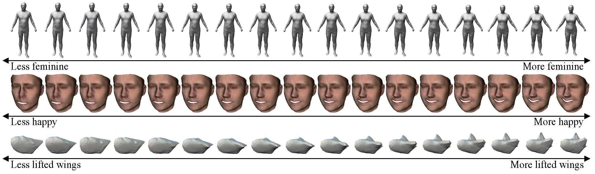

# [Rank3DGAN: Semantic mesh generation using relative attributes](https://arxiv.org/pdf/1905.10257.pdf)

This repository provides Tensorflow implementations for Rank3DGAN paper.

This code is heavily based on Multi-chart Generative Surface Modeling implementation [multichart3dgans](https://github.com/helibenhamu/multichart3dgans).

## Models

`shape_version`: the project code for watertight meshes (human and bird shapes) that requires triplet of landmarks
`face_version`: the project code for face meshes that requires quadriplet of landmarks

## Datasets

- [HumanShape](https://github.com/leonid-pishchulin/humanshape)
- [Basel Face Model](https://faces.dmi.unibas.ch/bfm/index.php?nav=1-1-0&id=details)
- [3D CUB](https://github.com/akanazawa/cmr)

For all the details of the data prepration, please check the paper Appendix.

For the data pre/post-processing, please check matlab folder.

## Prerequisites

- Python 3.5
- TensorFlow 1.6
- `bunch` and `tqdm` packages

## Dataset creation

Check `matlab/createDataset.m` for the details. To transform the charts to tfrecords format use:
- For the case of single meshes dataset:
```
python3 convert_to_tfrecords.py --database_signature=<database_signature>
```
- For the case of pairwise comparison meshes dataset:
```
python3 convert_to_tfrecords.py --database_signature=<database_signature> -p
```

## Rank3DGAN training

```
python3 gan_main.py -c=configs/<my_config>.json
```

## Rank3DGAN testing

```
python3 evaluate_main.py -c=configs/config.json
```
After getting the generated charts. Use `matlab/inspectGeneratedData.m` to obtain the resulting meshes.

## Mesh generation

<p align="center">

</p>

